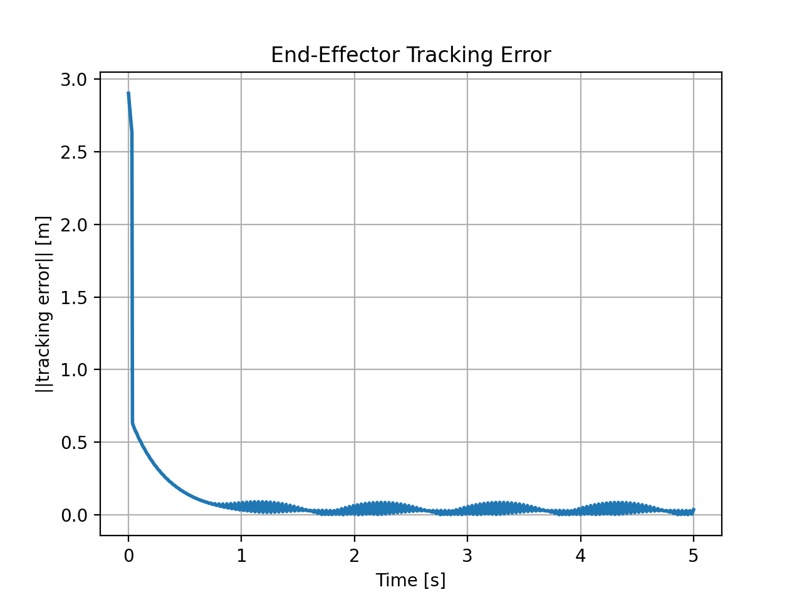
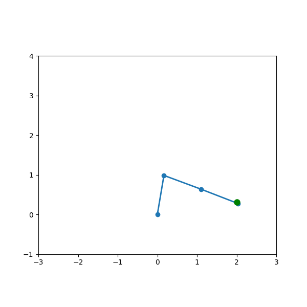
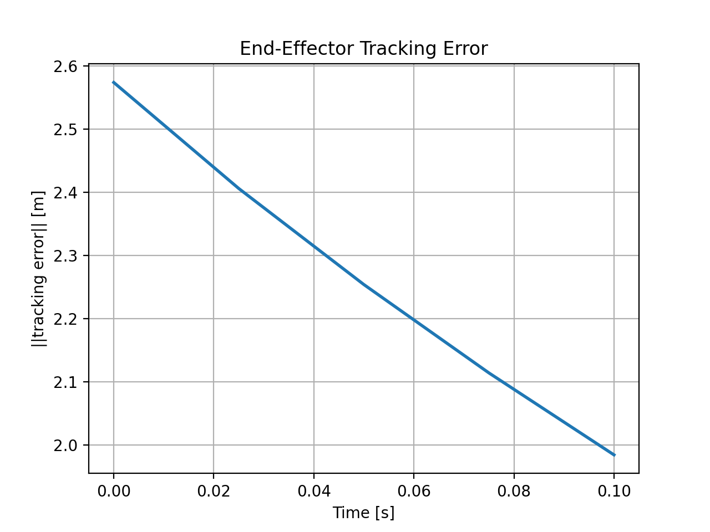
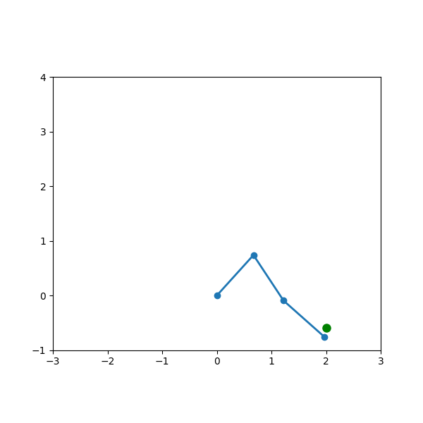
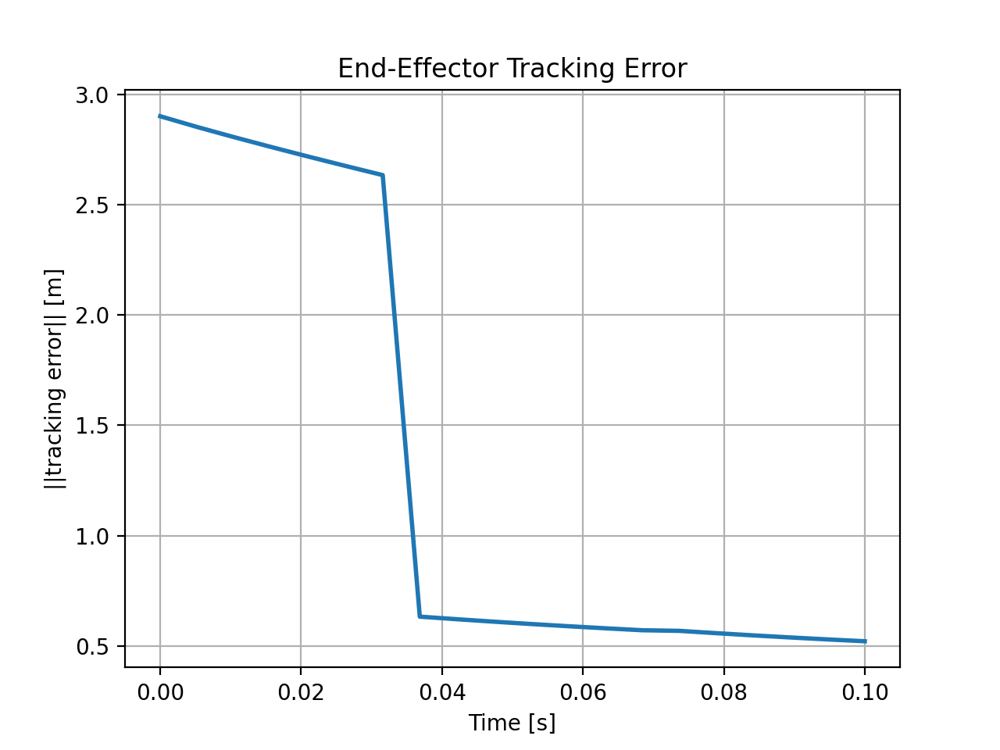
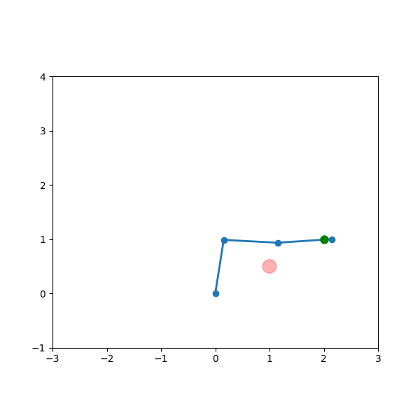

 

# RRR Robot End-Effector Tracking

## Overview

This project implements a **resolved-rate control** law with velocity feed-forward for a planar 3-DOF RRR robot arm, demonstrating:

* **Fast-loop baseline** (200 Hz control, 30 Hz measurement)
* **Slow-loop comparison** (50 Hz control, 5 Hz measurement)
* **Obstacle avoidance** around a circular obstacle

## Repository Structure

```text
rrr_robot_control/
├── src/
│   ├── robot.py        # RRRRobot kinematics & Jacobian
│   ├── sim.py          # Target trajectory generator
│   ├── controller.py   # Resolved-rate + feed-forward logic
│   └── main.py         # Main script: runs, plots, animates
├── tests/              # Unit and smoke tests
├── Dockerfile          # Docker container spec
├── requirements.txt    # Python dependencies
├── README.md           # Project documentation
└── .github/
    └── workflows/ci.yml  # GitHub Actions CI pipeline
```

## Installation

**Prerequisites:** Python 3.8+, Git, Docker (optional)

```bash
git clone https://github.com/nipundhawan/rrr_robot_control.git
cd rrr_robot_control

python3 -m venv venv
source venv/bin/activate

pip install --upgrade pip
pip install -r requirements.txt
```

## Usage

Run one scenario at a time:

```bash
python3 src/main.py --mode fast      # Fast loop (200 Hz ctrl, 30 Hz meas)
python3 src/main.py --mode slow      # Slow loop (50 Hz ctrl, 5 Hz meas)
python3 src/main.py --mode obstacle  # Obstacle avoidance
```

Each invocation will:

1. Plot and save the tracking-error curve (e.g. `error_200x30.png`).
2. Animate the robot following the green dot (and obstacle when in obstacle mode).

## Results

| Mode               | RMS Error \[m] | Error Plot                        | Animation                 |
| ------------------ | -------------- | --------------------------------- | ------------------------- |
| Fast (200×30)      | 0.261          |          |     |
| Slow (50×5)        | 0.446          |            |     |
| Obstacle Avoidance | 0.261          |  |  |

## Control Law

We use a resolved-rate law with velocity feed-forward of the target’s velocity:

```math
\dot{q} = J^\dagger(\dot{x}_{des} + K_p (x_{des}-x))
```

* $J^\dagger$: Moore–Penrose pseudoinverse of the Jacobian
* $K_p = 3.0$: proportional gain (tunable)

## Obstacle Avoidance

When the end-effector enters a circular obstacle (center `c`, radius `r`):

1. Compute $d = \|p_e - c\|$.
2. If $d < r$, override velocity command:

   ```math
   p_{block} = c + (p_e-c)/d * r,  
   \dot{q} = J^\dagger(K_p (p_{block}-p_e))
   ```

## Docker

Build and run:

```bash
docker build -t rrr_ctrl .
docker run --rm -it rrr_ctrl --mode fast
```

This uses the **fast** mode by default.

## Continuous Integration

See `.github/workflows/ci.yml`, which:

1. Checks out code
2. Sets up Python 3.8
3. Installs dependencies
4. Runs `flake8` + `pytest`
5. Builds and optionally pushes a Docker image

## Testing

```bash
pytest --maxfail=1 --disable-warnings -q
```

## Coverage

Coverage reports are uploaded via Codecov. See badge above.

## Release & Versioning

* Tag a new release:

  ```bash
  ```

git tag v1.0
git push origin v1.0

```
- Draft a GitHub release on the `v1.0` tag.

## Branch Protection
Require PR reviews and passing CI on `main` via GitHub settings.

## License
MIT License

```
